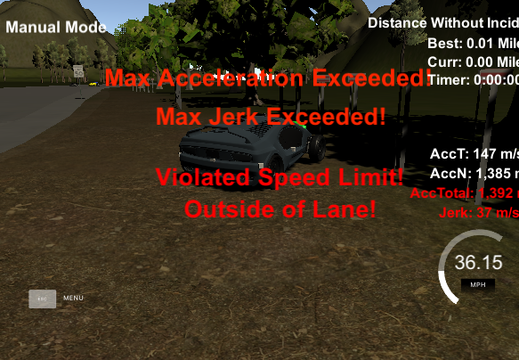
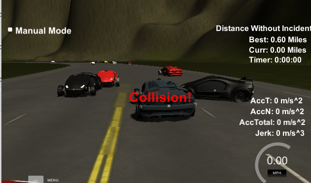
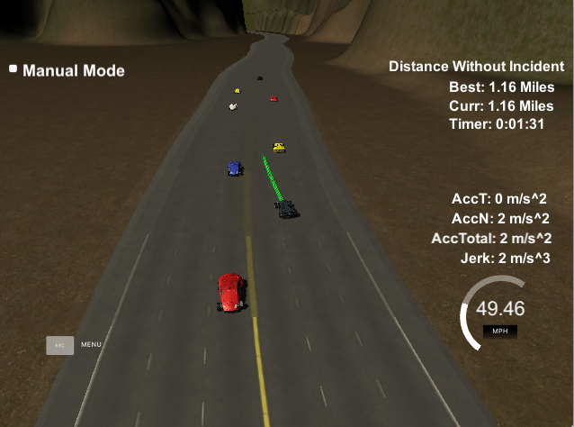
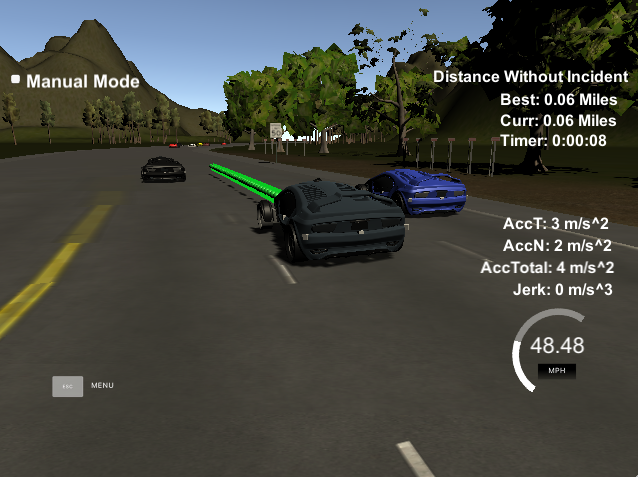

# CarND-Path-Planning-Project
Self-Driving Car Engineer Nanodegree Program

### Introduction 
 
 This project mainly focuses navigating a car in a highway sinario where 
 there is traffic and the car is suppose to make decisions on the movement of the car 
 such that there are no jerk when transition between lanes .
 The  goal of the self driving  car are as mention in the goals mentioned below.
 


 ### Model
 To run this project  data is been sent from the simulator  to the program though sockets. We  provided with waypoint data from the simulator weare to make the following assumption.
 
 Each waypoint has an (x,y) global map position, and a Frenet s value and Frenet d unit normal vector (split up into the x component, and the y component).
 
 The s value is the distance along the direction of the road. The first waypoint has an s value of 0 because it is the starting point.
 
 The d vector has a magnitude of 1 and points perpendicular to the road in the direction of the right-hand side of the road. The d vector can be used to calculate lane positions. For example, if you want to be in the left lane at some waypoint just add the waypoint's (x,y) coordinates with the d vector multiplied by 2. Since the lane is 4 m wide, the middle of the left lane (the lane closest to the double-yellow diving line) is 2 m from the waypoint.
 
 If you would like to be in the middle lane, add the waypoint's coordinates to the d vector multiplied by 6 = (2+4), since the center of the middle lane is 4 m from the center of the left lane, which is itself 2 m from the double-yellow diving line and the waypoints.
 
 
We are trying to avoid jerk ,speed violation , and type of collision that would 
 
 
 
 
 
 We would like to have a senario where you are getting smooth lane transition without 
 breaking the speed limit ,  collision  and  any behaviour that would harm or make the user uncomfertable.
 
 
 
 
 
###The model is pretty straight forward.
-  The input that is the simulators data is in the form of 
```text
42["telemetry",{"x":909.48,"y":1128.67,"yaw":0,"speed":0,"s":124.8336,"d":6.164833,"previous_path_x":[],"previous_path_y":[],"end_path_s":0,"end_path_d":0,"sensor_fusion":[[0,1056.788,1164.296,37.39919,15.43803,275.7777,5.999895],[1,775.8,1425.2,0,0,6719.219,-280.1494],[2,775.8,1429,0,0,6716.599,-282.9019],[3,775.8,1432.9,0,0,6713.911,-285.7268],[4,775.8,1436.3,0,0,6711.566,-288.1896],[5,775.8,1441.7,0,0,6661.772,-291.7797],[6,762.1,1421.6,0,0,6711.778,-268.0964],[7,762.1,1425.2,0,0,6709.296,-270.7039],[8,762.1,1429,0,0,6663.543,-273.1828],[9,762.1,1432.9,0,0,6660.444,-275.5511],[10,762.1,1436.3,0,0,6657.743,-277.6157],[11,762.1,1441.7,0,0,6653.453,-280.8947]]}]
2
42["telemetry",{"x":909.484,"y":1128.67,"yaw":0,"speed":0.2252774,"s":124.8377,"d":6.164867,"previous_path_x":[909.486,909.488,909.49,909.492,909.494,909.496,909.498,909.5,909.502,909.504,909.506,909.508,909.51,909.512,909.514,909.516,909.518,909.52,909.522,909.524,909.526,909.528,909.53,909.532,909.534,909.5359,909.538,909.54,909.542,909.5439,909.546,909.548,909.55,909.5519,909.554,909.556,909.558,909.5599,909.562,909.564,909.566,909.568,909.5699,909.572,909.574,909.576,909.5779,909.58],"previous_path_y":[1128.67,1128.67,1128.67,1128.67,1128.67,1128.67,1128.67,1128.67,1128.67,1128.67,1128.67,1128.67,1128.67,1128.67,1128.67,1128.67,1128.67,1128.67,1128.67,1128.67,1128.67,1128.67,1128.67,1128.67,1128.67,1128.67,1128.67,1128.67,1128.67,1128.67,1128.67,1128.67,1128.67,1128.67,1128.67,1128.67,1128.67,1128.67,1128.67,1128.67,1128.67,1128.67,1128.67,1128.67,1128.67,1128.67,1128.67,1128.67],"end_path_s":124.9337,"end_path_d":6.165697,"sensor_fusion":[[0,1057.466,1164.576,16.28259,6.724958,276.4613,6.003087],[1,775.8,1425.2,0,0,6719.219,-280.1494],[2,775.8,1429,0,0,6716.599,-282.9019],[3,775.8,1432.9,0,0,6713.911,-285.7268],[4,775.8,1436.3,0,0,6711.566,-288.1896],[5,775.8,1441.7,0,0,6661.772,-291.7797],[6,762.1,1421.6,0,0,6711.778,-268.0964],[7,762.1,1425.2,0,0,6709.296,-270.7039],[8,762.1,1429,0,0,6663.543,-273.1828],[9,762.1,1432.9,0,0,6660.444,-275.5511],[10,762.1,1436.3,0,0,6657.743,-277.6157],[11,762.1,1441.7,0,0,6653.453,-280.8947]]}]
42["telemetry",{"x":909.486,"y":1128.67,"yaw":0,"speed":0.2252774,"s":124.8397,"d":6.164885,"previous_path_x":[909.488,909.49,909.492,909.494,909.496,909.498,909.5,909.502,909.504,909.506,909.508,909.51,909.512,909.514,909.516,909.518,909.52,909.522,909.524,909.526,909.528,909.53,909.532,909.534,909.5359,909.538,909.54,909.542,909.5439,909.546,909.548,909.55,909.5519,909.554,909.556,909.558,909.5599,909.562,909.564,909.566,909.568,909.5699,909.572,909.574,909.576,909.5779,909.58,909.584,909.588],"previous_path_y":[1128.67,1128.67,1128.67,1128.67,1128.67,1128.67,1128.67,1128.67,1128.67,1128.67,1128.67,1128.67,1128.67,1128.67,1128.67,1128.67,1128.67,1128.67,1128.67,1128.67,1128.67,1128.67,1128.67,1128.67,1128.67,1128.67,1128.67,1128.67,1128.67,1128.67,1128.67,1128.67,1128.67,1128.67,1128.67,1128.67,1128.67,1128.67,1128.67,1128.67,1128.67,1128.67,1128.67,1128.67,1128.67,1128.67,1128.67,1128.67,1128.67],"end_path_s":124.9417,"end_path_d":6.165766,"sensor_fusion":[[0,1057.934,1164.769,16.02007,6.61781,276.9674,6.005268],[1,775.8,1425.2,0,0,6719.219,-280.1494],[2,775.8,1429,0,0,6716.599,-282.9019],[3,775.8,1432.9,0,0,6713.911,-285.7268],[4,775.8,1436.3,0,0,6711.566,-288.1896],[5,775.8,1441.7,0,0,6661.772,-291.7797],[6,762.1,1421.6,0,0,6711.778,-268.0965],[7,762.1,1425.2,0,0,6709.296,-270.7039],[8,762.1,1429,0,0,6663.543,-273.1828],[9,762.1,1432.9,0,0,6660.444,-275.5511],[10,762.1,1436.3,0,0,6657.743,-277.6157],[11,762.1,1441.7,0,0,6653.453,-280.8947]]}]
42["telemetry",{"x":909.488,"y":1128.67,"yaw":0,"speed":0.2184508,"s":124.8416,"d":6.164902,"previous_path_x":[909.49,909.492,909.494,909.496,909.498,909.5,909.502,909.504,909.506,909.508,909.51,909.512,909.514,909.516,909.518,909.52,909.522,909.524,909.526,909.528,909.53,909.532,909.534,909.5359,909.538,909.54,909.542,909.5439,909.546,909.548,909.55,909.5519,909.554,909.556,909.558,909.5599,909.562,909.564,909.566,909.568,909.5699,909.572,909.574,909.576,909.5779,909.58,909.584,909.588,909.594],"previous_path_y":[1128.67,1128.67,1128.67,1128.67,1128.67,1128.67,1128.67,1128.67,1128.67,1128.67,1128.67,1128.67,1128.67,1128.67,1128.67,1128.67,1128.67,1128.67,1128.67,1128.67,1128.67,1128.67,1128.67,1128.67,1128.67,1128.67,1128.67,1128.67,1128.67,1128.67,1128.67,1128.67,1128.67,1128.67,1128.67,1128.67,1128.67,1128.67,1128.67,1128.67,1128.67,1128.67,1128.67,1128.67,1128.67,1128.67,1128.67,1128.67,1128.67],"end_path_s":124.9476,"end_path_d":6.165818,"sensor_fusion":[[0,1058.248,1164.899,15.87382,6.558905,277.3074,6.00677],[1,775.8,1425.2,0,0,6719.219,-280.1494],[2,775.8,1429,0,0,6716.599,-282.9019],[3,775.8,1432.9,0,0,6713.911,-285.7268],[4,775.8,1436.3,0,0,6711.566,-288.1896],[5,775.8,1441.7,0,0,6661.772,-291.7797],[6,762.1,1421.6,0,0,6711.778,-268.0964],[7,762.1,1425.2,0,0,6709.296,-270.7039],[8,762.1,1429,0,0,6663.543,-273.1828],[9,762.1,1432.9,0,0,6660.444,-275.5511],[10,762.1,1436.3,0,0,6657.743,-277.6157],[11,762.1,1441.7,0,0,6653.453,-280.8947]]}]
42["telemetry",{"x":909.49,"y":1128.67,"yaw":0,"speed":0.2252774,"s":124.8436,"d":6.164919,"previous_path_x":[909.492,909.494,909.496,909.498,909.5,909.502,909.504,909.506,909.508,909.51,909.512,909.514,909.516,909.518,909.52,909.522,909.524,909.526,909.528,909.53,909.532,909.534,909.5359,909.538,909.54,909.542,909.5439,909.546,909.548,909.55,909.5519,909.554,909.556,909.558,909.5599,909.562,909.564,909.566,909.568,909.5699,909.572,909.574,909.576,909.5779,909.58,909.584,909.588,909.594,909.602],"previous_path_y":[1128.67,1128.67,1128.67,1128.67,1128.67,1128.67,1128.67,1128.67,1128.67,1128.67,1128.67,1128.67,1128.67,1128.67,1128.67,1128.67,1128.67,1128.67,1128.67,1128.67,1128.67,1128.67,1128.67,1128.67,1128.67,1128.67,1128.67,1128.67,1128.67,1128.67,1128.67,1128.67,1128.67,1128.67,1128.67,1128.67,1128.67,1128.67,1128.67,1128.67,1128.67,1128.67,1128.67,1128.67,1128.67,1128.67,1128.67,1128.67,1128.67],"end_path_s":124.9556,"end_path_d":6.165887,"sensor_fusion":[[0,1058.551,1165.024,15.75938,6.513164,277.6351,6.008057],[1,775.8,1425.2,0,0,6719.219,-280.1494],[2,775.8,1429,0,0,6716.599,-282.9019],[3,775.8,1432.9,0,0,6713.911,-285.7268],[4,775.8,1436.3,0,0,6711.566,-288.1896],[5,775.8,1441.7,0,0,6661.772,-291.7797],[6,762.1,1421.6,0,0,6711.778,-268.0963],[7,762.1,1425.2,0,0,6709.296,-270.7039],[8,762.1,1429,0,0,6663.543,-273.1828],[9,762.1,1432.9,0,0,6660.444,-275.5511],[10,762.1,1436.3,0,0,6657.743,-277.6157],[11,762.1,1441.7,0,0,6653.453,-280.8947]]}]
42["telemetry",{"x":909.492,"y":1128.67,"yaw":0,"speed":0.2252774,"s":124.8456,"d":6.164937,"previous_path_x":[909.494,909.496,909.498,909.5,909.502,909.504,909.506,909.508,909.51,909.512,909.514,909.516,909.518,909.52,909.522,909.524,909.526,909.528,909.53,909.532,909.534,909.5359,909.538,909.54,909.542,909.5439,909.546,909.548,909.55,909.5519,909.554,909.556,909.558,909.5599,909.562,909.564,909.566,909.568,909.5699,909.572,909.574,909.576,909.5779,909.58,909.584,909.588,909.594,909.602,909.612],"previous_path_y":[1128.67,1128.67,1128.67,1128.67,1128.67,1128.67,1128.67,1128.67,1128.67,1128.67,1128.67,1128.67,1128.67,1128.67,1128.67,1128.67,1128.67,1128.67,1128.67,1128.67,1128.67,1128.67,1128.67,1128.67,1128.67,1128.67,1128.67,1128.67,1128.67,1128.67,1128.67,1128.67,1128.67,1128.67,1128.67,1128.67,1128.67,1128.67,1128.67,1128.67,1128.67,1128.67,1128.67,1128.67,1128.67,1128.67,1128.67,1128.67,1128.67],"end_path_s":124.9656,"end_path_d":6.165974,"sensor_fusion":[[0,1058.892,1165.165,15.75691,6.513713,278.0043,6.009764],[1,775.8,1425.2,0,0,6719.219,-280.1494],[2,775.8,1429,0,0,6716.599,-282.9019],[3,775.8,1432.9,0,0,6713.911,-285.7268],[4,775.8,1436.3,0,0,6711.566,-288.1896],[5,775.8,1441.7,0,0,6661.772,-291.7797],[6,762.1,1421.6,0,0,6711.778,-268.0964],[7,762.1,1425.2,0,0,6709.296,-270.7039],[8,762.1,1429,0,0,6663.543,-273.1828],[9,762.1,1432.9,0,0,6660.444,-275.5511],[10,762.1,1436.3,0,0,6657.743,-277.6157],[11,762.1,1441.7,0,0,6653.453,-280.8947]]}]
.......
```

This could be termed as way points / or a path and get the previous path if exists .


Initialling the code  the lane and reference velocity is kept as 
```cpp
int lane = 1;

double ref_vel = 0.0; // mph
```


All of the densor data is read from way points and decision is made if the car has to change lane  and no 
other car its going to hit or reduce speed if a car is in front.
```cpp
 // check the lane of the car 
if (d < (2 + 4 * lane + 2) && d > (2 + 4 * lane - 2)) 

``` 

If the ego car and another car are close then you need to reduce velocity and check if the lane can bbe shifted.

We check this by 
```cpp

// here  the 30 represents that the car is at least 30 meters away.
if ((check_car_s > car_s) && ((check_car_s - car_s) < 30)) {


//velocity is increased or decreades in increments to avoid jerks

if (too_close) {
                ref_vel -= .224;
            } else if (ref_vel < 49.5) {
                ref_vel += .224;
            } 
```


When shifting lanes it would be smoother if we used a few waypoints from the previous  path and attach it to the current 
waypoints/path.
If there is previous path then add the points
```cpp
ref_x = previous_path_x[prev_size - 1];
ref_y = previous_path_y[prev_size - 1];
```

Get the XY  points from the frenet coordinates of every 30 m  interval
```cpp
//in Frenet add evenly 30 m saved points ahead of the  starting reference
			vector<double> next_wp0 = getXY(car_s + 30, (2 + 4 * lane), map_waypoints_s, map_waypoints_x,
											map_waypoints_y);
			vector<double> next_wp1 = getXY(car_s + 60, (2 + 4 * lane), map_waypoints_s, map_waypoints_x,
											map_waypoints_y);
			vector<double> next_wp2 = getXY(car_s + 90, (2 + 4 * lane), map_waypoints_s, map_waypoints_x,
											map_waypoints_y);


            ptsx.push_back(next_wp0[0]);
			ptsx.push_back(next_wp1[0]);
			ptsx.push_back(next_wp2[0]);

			ptsy.push_back(next_wp0[1]);
			ptsy.push_back(next_wp1[1]);
			ptsy.push_back(next_wp2[1]);
```

shift the car reference angle to 0 degree
```cpp
 ptsx[i] = (shift_x * cos(0 - ref_yaw) - shift_y * sin(0 - ref_yaw));
 ptsy[i] = (shift_x * sin(0 - ref_yaw) + shift_y * cos(0 - ref_yaw));
```

Now with all the xy points we need to create a trejectory / spline to which the car move.
We use the spline lib that would interpolate all the XY points for us.
```cpp
//create a spline
tk::spline s;

 // set the x and y points to spline
s.set_points(ptsx, ptsy);

```
 Convert the list of points back to frenet system and pass the list of points to the car.
 Push the new set of values to the nextX and next y

```cpp
                // rotating back to normal after rotating at earlier
				x_point = (x_ref * cos(ref_yaw) - y_ref * sin(ref_yaw));
				y_point = (x_ref * sin(ref_yaw) + y_ref * cos(ref_yaw));

				x_point += ref_x;
				y_point += ref_y;

				next_x_vals.push_back(x_point);
				next_y_vals.push_back(y_point);
			}

          	msgJson["next_x"] = next_x_vals;
          	msgJson["next_y"] = next_y_vals;


```
 
 We expect an output such as this :

  

 
### Simulator.
You can download the Term3 Simulator which contains the Path Planning Project from the [releases tab (https://github.com/udacity/self-driving-car-sim/releases).

### Goals
In this project your goal is to safely navigate around a virtual highway with other traffic that is driving +-10 MPH of the 50 MPH speed limit. You will be provided the car's localization and sensor fusion data, there is also a sparse map list of waypoints around the highway. The car should try to go as close as possible to the 50 MPH speed limit, which means passing slower traffic when possible, note that other cars will try to change lanes too. The car should avoid hitting other cars at all cost as well as driving inside of the marked road lanes at all times, unless going from one lane to another. The car should be able to make one complete loop around the 6946m highway. Since the car is trying to go 50 MPH, it should take a little over 5 minutes to complete 1 loop. Also the car should not experience total acceleration over 10 m/s^2 and jerk that is greater than 50 m/s^3.

#### The map of the highway is in data/highway_map.txt
Each waypoint in the list contains  [x,y,s,dx,dy] values. x and y are the waypoint's map coordinate position, the s value is the distance along the road to get to that waypoint in meters, the dx and dy values define the unit normal vector pointing outward of the highway loop.

The highway's waypoints loop around so the frenet s value, distance along the road, goes from 0 to 6945.554.

## Basic Build Instructions

1. Clone this repo.
2. Make a build directory: `mkdir build && cd build`
3. Compile: `cmake .. && make`
4. Run it: `./path_planning`.

Here is the data provided from the Simulator to the C++ Program

#### Main car's localization Data (No Noise)

["x"] The car's x position in map coordinates

["y"] The car's y position in map coordinates

["s"] The car's s position in frenet coordinates

["d"] The car's d position in frenet coordinates

["yaw"] The car's yaw angle in the map

["speed"] The car's speed in MPH

#### Previous path data given to the Planner

//Note: Return the previous list but with processed points removed, can be a nice tool to show how far along
the path has processed since last time. 

["previous_path_x"] The previous list of x points previously given to the simulator

["previous_path_y"] The previous list of y points previously given to the simulator

#### Previous path's end s and d values 

["end_path_s"] The previous list's last point's frenet s value

["end_path_d"] The previous list's last point's frenet d value

#### Sensor Fusion Data, a list of all other car's attributes on the same side of the road. (No Noise)

["sensor_fusion"] A 2d vector of cars and then that car's [car's unique ID, car's x position in map coordinates, car's y position in map coordinates, car's x velocity in m/s, car's y velocity in m/s, car's s position in frenet coordinates, car's d position in frenet coordinates. 

## Details

1. The car uses a perfect controller and will visit every (x,y) point it recieves in the list every .02 seconds. The units for the (x,y) points are in meters and the spacing of the points determines the speed of the car. The vector going from a point to the next point in the list dictates the angle of the car. Acceleration both in the tangential and normal directions is measured along with the jerk, the rate of change of total Acceleration. The (x,y) point paths that the planner recieves should not have a total acceleration that goes over 10 m/s^2, also the jerk should not go over 50 m/s^3. (NOTE: As this is BETA, these requirements might change. Also currently jerk is over a .02 second interval, it would probably be better to average total acceleration over 1 second and measure jerk from that.

2. There will be some latency between the simulator running and the path planner returning a path, with optimized code usually its not very long maybe just 1-3 time steps. During this delay the simulator will continue using points that it was last given, because of this its a good idea to store the last points you have used so you can have a smooth transition. previous_path_x, and previous_path_y can be helpful for this transition since they show the last points given to the simulator controller with the processed points already removed. You would either return a path that extends this previous path or make sure to create a new path that has a smooth transition with this last path.

## Tips

A really helpful resource for doing this project and creating smooth trajectories was using http://kluge.in-chemnitz.de/opensource/spline/, the spline function is in a single hearder file is really easy to use.

---

## Dependencies

* cmake >= 3.5
 * All OSes: [click here for installation instructions](https://cmake.org/install/)
* make >= 4.1
  * Linux: make is installed by default on most Linux distros
  * Mac: [install Xcode command line tools to get make](https://developer.apple.com/xcode/features/)
  * Windows: [Click here for installation instructions](http://gnuwin32.sourceforge.net/packages/make.htm)
* gcc/g++ >= 5.4
  * Linux: gcc / g++ is installed by default on most Linux distros
  * Mac: same deal as make - [install Xcode command line tools]((https://developer.apple.com/xcode/features/)
  * Windows: recommend using [MinGW](http://www.mingw.org/)
* [uWebSockets](https://github.com/uWebSockets/uWebSockets)
  * Run either `install-mac.sh` or `install-ubuntu.sh`.
  * If you install from source, checkout to commit `e94b6e1`, i.e.
    ```
    git clone https://github.com/uWebSockets/uWebSockets 
    cd uWebSockets
    git checkout e94b6e1
    ```

## Editor Settings

We've purposefully kept editor configuration files out of this repo in order to
keep it as simple and environment agnostic as possible. However, we recommend
using the following settings:

* indent using spaces
* set tab width to 2 spaces (keeps the matrices in source code aligned)

## Code Style

Please (do your best to) stick to [Google's C++ style guide](https://google.github.io/styleguide/cppguide.html).

## Project Instructions and Rubric

Note: regardless of the changes you make, your project must be buildable using
cmake and make!


## Call for IDE Profiles Pull Requests

Help your fellow students!

We decided to create Makefiles with cmake to keep this project as platform
agnostic as possible. Similarly, we omitted IDE profiles in order to ensure
that students don't feel pressured to use one IDE or another.

However! I'd love to help people get up and running with their IDEs of choice.
If you've created a profile for an IDE that you think other students would
appreciate, we'd love to have you add the requisite profile files and
instructions to ide_profiles/. For example if you wanted to add a VS Code
profile, you'd add:

* /ide_profiles/vscode/.vscode
* /ide_profiles/vscode/README.md

The README should explain what the profile does, how to take advantage of it,
and how to install it.

Frankly, I've never been involved in a project with multiple IDE profiles
before. I believe the best way to handle this would be to keep them out of the
repo root to avoid clutter. My expectation is that most profiles will include
instructions to copy files to a new location to get picked up by the IDE, but
that's just a guess.

One last note here: regardless of the IDE used, every submitted project must
still be compilable with cmake and make./


## Additional information and references:
Splines.h lib localtion : http://kluge.in-chemnitz.de/opensource/spline/spline.h


